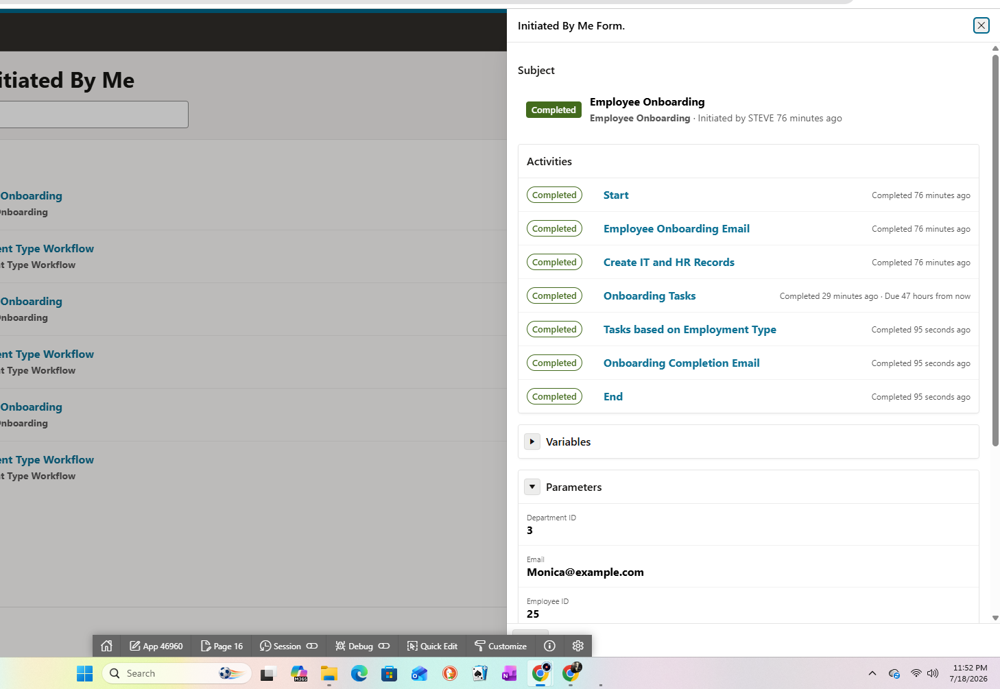

# Test Execution Summary

## Release decision

**Conditional pass / portfolio release ready.** The complete onboarding path passed after fixes. One medium-severity UX improvement remains: duplicate-email errors should be translated into a user-friendly validation message.

## Execution result

| Area | Result | Notes |
|---|---|---|
| Application launch and home navigation | Pass after fix | Cards and hierarchy corrected |
| Employee form and creation | Pass | Success message and report verified |
| Email notification | Pass | Delivered to test inbox |
| IT task generation and assignment | Pass | STEVE → AMY hand-off verified |
| IT action routing | Pass after fix | Trailing-space target defect corrected |
| Duplicate-email validation | Partial | Integrity protected; raw ORA message remains |
| Training selection | Pass after fix | Audience value standardized |
| New-hire task visibility | Pass | MONICA received Allocate Trainings |
| Task completion | Pass | Completion confirmation observed |
| Parent workflow completion | Pass | All activities completed |

## End-to-end evidence narrative

1. STEVE accessed the application and opened the new-employee form.
2. Valid employee data was submitted and APEX confirmed that onboarding was initiated.
3. The employee appeared in the administration report.
4. The onboarding email was delivered to the configured test inbox.
5. IT Setup was generated, assigned to AMY, and displayed the correct employee parameters.
6. IT actions were completed after correcting the Page 11 target-item defect.
7. Training assignment initially faulted because `Full Time` did not match `Full-Time`.
8. Reference data was corrected and the workflow was retried.
9. MONICA received and completed Allocate Trainings.
10. The final workflow detail showed every activity and the overall Employee Onboarding workflow as Completed.

## Final evidence

## Residual risks and next test cycle

- Add friendly duplicate-email validation and retest case-insensitive duplicates.
- Confirm behavior for Intern, Part Time, and unsupported employee types.
- Test expired tasks, reassignment, claim/release behavior, and workflow suspension.
- Add cross-browser coverage for Chromium, Firefox, and WebKit.
- Run WCAG-oriented keyboard, label, focus, contrast, and error-announcement checks.
- Automate the critical smoke and happy-path scenarios in Playwright and execute them in GitHub Actions.

## Interview-ready summary

> I built and tested an Oracle APEX employee-onboarding workflow across three user roles. I designed a risk-based test set, validated UI behavior against database and workflow state, verified outbound email, and found four defects. Two high-severity issues blocked task progression: an invalid APEX item target and inconsistent employee-type reference data. I isolated both root causes, verified the fixes, retried the faulted workflows, and completed a full end-to-end regression through the final onboarding email and completed workflow state.
